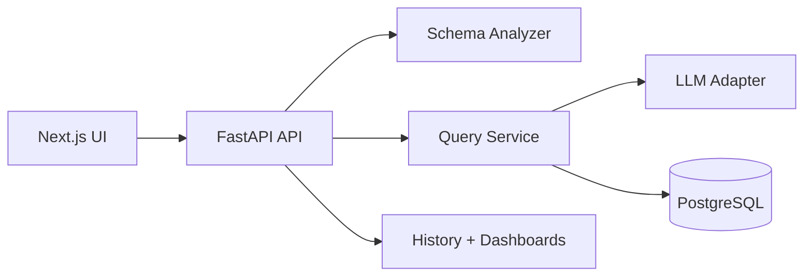

# Text-to-SQL System

An enterprise-style Text-to-SQL product that turns natural language into safe, executable SQL with traceable results and a modern analytics UI.

Built to demonstrate production-grade patterns: schema intelligence, guardrails, self-healing SQL, and a full workflow from CSV upload to dashboards.

Repository code lives in `text-to-sql-system/`.

**Highlights**
- Natural language to SQL with guardrails and retry fixes
- CSV upload to PostgreSQL with automatic schema profiling
- Schema annotations for column aliases and metrics
- SQL editor, drilldowns, dashboard pins, and explainability
- Clarification flow for ambiguous questions

**Demo**


**Architecture**


**Tech Stack**
- Backend: FastAPI, SQLAlchemy, PostgreSQL
- Frontend: Next.js, Monaco Editor, Recharts
- LLM: Local OpenAI-style endpoint or Gemini wrapper

**Quickstart**
1. Create virtual environment
```
cd text-to-sql-system
python3 -m venv .venv
source .venv/bin/activate
```
2. Configure environment
```
cd text-to-sql-system
cp .env.example .env
```
3. Run the LLM wrapper (optional, for Gemini)
```
cd text-to-sql-system
source .venv/bin/activate
set -a && source .env && set +a
uvicorn gemini_api_wrapper:app --host 127.0.0.1 --port 8501
```
4. Start backend
```
cd text-to-sql-system/backend
source ../.venv/bin/activate
pip install -r requirements.txt
uvicorn main:app --host 0.0.0.0 --port 8000 --reload
```
5. Start frontend (Next.js)
```
cd text-to-sql-system/frontend-next
npm install
npm run dev -- --hostname 127.0.0.1 --port 3005
```
Frontend runs at `http://localhost:3005`.

**Key API Endpoints**
- `POST /api/upload` upload CSV and create table
- `POST /api/query` NL to SQL and results
- `POST /api/query/run-sql` run edited SQL safely
- `POST /api/query/fix` fix SQL with LLM
- `POST /api/query/regenerate` regenerate SQL with context
- `POST /api/sql/explain` explain SQL in steps
- `GET /api/schema` retrieve schema
- `GET/POST /api/schema/annotations` data dictionary
- `GET /api/history` query history
- `GET/POST /api/dashboards` dashboard pins
- `POST /api/query/drilldown` drilldown rows
- `GET /api/llm/health` LLM health
- `GET /api/llm/test` LLM test

**Safety and Guardrails**
- SELECT-only enforcement
- Identifier and table validation
- LIMIT enforcement and timeouts
- SQL sanitization before validation

**Demo Script**
- See `test_queries.md` for ready-to-run demo questions and expected SQL.

**Status**
- Current status and roadmap are maintained internally.

**Repository Layout**
- `text-to-sql-system/backend` FastAPI backend
- `text-to-sql-system/frontend-next` Next.js UI (active)
- `text-to-sql-system/frontend` legacy React UI

**Notes**
- Schema annotations are saved per table and reused across queries.
- LLM prompts include schema and may include small result samples.

**Contributing**
See `CONTRIBUTING.md`.

**License**
MIT. See `LICENSE`.
